<!--
context:
- https://www.linkedin.com/in/martin-stuehmer/
- https://github.com/samtrion
- https://www.cgi.com/de/de/experts/martin-stuehmer
- https://learn.microsoft.com/en-us/users/martinstuehmer/transcript/vjz8mfely98jjzx

helpful-links:
- https://github.com/ikatyang/emoji-cheat-sheet
-->
# Hi :wave:, I'm Martin
---

I'm a multi-talented professional with a strong background in software development, enterprise architecture, and technology consulting. I'm passionate about using technology to drive innovation and deliver high quality solutions that meet the needs of both customers and users. My expertise spans a wide range of domains, including cloud computing, DevOps, and software engineering, particularly in the .NET ecosystem.

I may be the typical *nerd* who loves to code, but I'm also a team player who enjoys working with others to solve complex problems and achieve common goals. I'm always eager to learn new things and keep up with the latest technologies and trends in the technology industry. My commitment to continuous improvement and professional development has allowed me to grow and succeed in my career.

I'm currently an Enterprise Architect at [CGI](https://www.cgi.com/), a leading IT and business consulting firm. In my role as Director Consulting Services, I help clients transform their business and IT landscapes by designing and implementing innovative solutions that drive digital transformation and business growth. As part of this role, I am also responsible for developing and mentoring my team members to help them reach their full potential. I'm proud to support them as a Microsoft Certified Trainer (MCT), instructor for CGI's [Risk and Cost Driven Architecture (RCDA)](https://www.cgi.com/de/de/solutions/rcda-agile-architektur), industry expert, and technology evangelist.

In addition to my work at [CGI](https://www.cgi.com/), I'm actively involved in the technology community, contributing to various open source projects on GitHub.

Can I help you with something? Feel free to contact me via [email](mailto:me@samtrion.net) or connect with me on [LinkedIn](https://www.linkedin.com/in/martin-stuehmer/).

<!--
## My current blog posts 

<table align="center">
    <thead>
        <tr>
            <th>English blog postings</th>
            <th>German blog postings</th>
        </tr>
    </thead>
    <tbody>
        <tr>
            <td>
                
            </td>
            <td>
                
            </td>
        </tr>
    </tbody>
</table>

- Updating my personal website with examples of my work on <a href="https://samtrion.net">samtrion.net</a>

-->
