# Hi :wave:, I'm Martin
---
<!-- Nice Links
GitHub Emoji Cheat Sheet - https://github.com/ikatyang/emoji-cheat-sheet
-->

## I'm a :cloud: Solutions Architect based in Cologne Bonn Region, Germany.

<!--
- I'm currently working full-time with awesome peeps at **[novaCapta](https://www.novacapta.de/)**
-->
- Reach me asap: [E-Mail](mailto:me@samtrion.net)
- Passionate about code performance and quality, committed to a fully automated world that works for everyone

## Find me around the web:
- Connecting and sharing professional updates on [LinkedIn](https://www.linkedin.com/in/martin-stuehmer/)

## My current blog posts 

<table align="center">
    <thead>
        <tr>
            <th>English blog postings</th>
            <th>German blog postings</th>
        </tr>
    </thead>
    <tbody>
        <tr>
            <td>
                
            </td>
            <td>
                
            </td>
        </tr>
    </tbody>
</table>

<!--
- Updating my personal website with examples of my work on <a href="https://samtrion.net">samtrion.net</a>

-->
